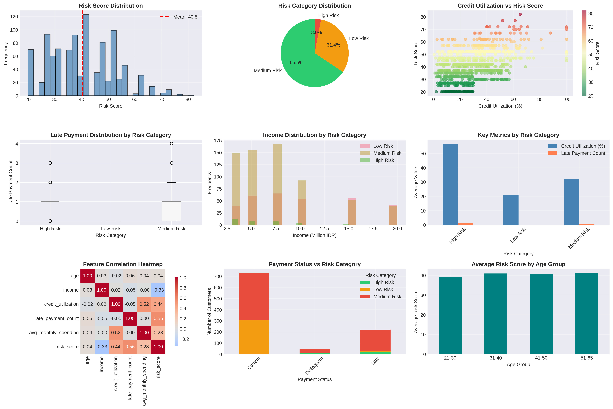

# 🎯 Customer Risk Scoring Model

[](https://www.python.org/downloads/)
[](LICENSE)
[]()

> A comprehensive risk scoring framework for credit card customer assessment using rule-based methodology and data-driven insights.



---

## 📋 Table of Contents
- [Overview](#overview)
- [Business Context](#business-context)
- [Features](#features)
- [Methodology](#methodology)
- [Installation](#installation)
- [Usage](#usage)
- [Results](#results)
- [Project Structure](#project-structure)
- [Technologies Used](#technologies-used)
- [Key Insights](#key-insights)
- [Future Enhancements](#future-enhancements)
- [Contributing](#contributing)
- [License](#license)
- [Contact](#contact)

---

## 🎯 Overview

This project develops a **Customer Risk Scoring System** to evaluate credit card customers and segment them into risk categories. The framework uses a weighted scoring methodology based on financial behavior, payment history, and demographic factors to support data-driven lending decisions.

### Key Objectives:
- Build a transparent, rule-based risk scoring model
- Segment customers into actionable risk categories
- Provide comprehensive visualizations for stakeholder insights
- Generate business recommendations for risk mitigation

---

## 💼 Business Context

**Industry:** Financial Services - Credit Card Lending  
**Problem Statement:** Credit card issuers need to assess customer creditworthiness to minimize default risk while maximizing portfolio profitability.

**Solution:** A quantitative risk scoring framework that:
- Identifies high-risk customers for enhanced monitoring
- Enables proactive intervention strategies
- Supports credit limit decisions
- Optimizes collection resources

**Impact:**
- Reduced default rates through early warning signals
- Improved portfolio quality through better segmentation
- Data-driven decision-making for credit policies

---

## ✨ Features

### Data Processing
- ✅ Synthetic data generation for 1,000+ customers
- ✅ Comprehensive data cleaning (missing values, outliers)
- ✅ Feature engineering for derived metrics
- ✅ Data validation and quality checks

### Risk Scoring Engine
- ✅ Multi-factor weighted scoring system (5 components)
- ✅ Transparent calculation methodology
- ✅ Three-tier risk categorization (Low/Medium/High)
- ✅ Customizable threshold parameters

### Analytics & Visualization
- ✅ 9 comprehensive visualizations in dashboard
- ✅ Statistical analysis by risk segment
- ✅ Correlation analysis for key drivers
- ✅ Distribution plots and comparative charts

### Business Intelligence
- ✅ Automated insights generation
- ✅ Segment-specific recommendations
- ✅ Portfolio health metrics
- ✅ Actionable intervention strategies

---

## 🔬 Methodology

### Risk Score Calculation

The risk score (0-100) is computed using a **weighted scoring system**:

| **Factor** | **Weight** | **Scoring Logic** |
|------------|------------|-------------------|
| Credit Utilization | 25% | <30%: 5pts \| 30-60%: 15pts \| >60%: 25pts |
| Late Payment Count | 30% | 0: 5pts \| 1-2: 20pts \| >2: 30pts |
| Income Level | 15% | >10M: 3pts \| 5-10M: 10pts \| <5M: 15pts |
| Payment Status | 20% | Current: 5pts \| Late: 15pts \| Delinquent: 20pts |
| Missed Payments (6m) | 10% | 0: 2pts \| 1-2: 7pts \| >2: 10pts |

**Final Score:** `Total Risk Score = Σ(Component Score × Weight)`

### Risk Segmentation

| **Category** | **Score Range** | **Characteristics** | **Action** |
|--------------|-----------------|---------------------|------------|
| 🟢 **Low Risk** | 0-33 | Excellent payment history, low utilization | Normal monitoring |
| 🟡 **Medium Risk** | 34-66 | Occasional delays, moderate utilization | Enhanced monitoring |
| 🔴 **High Risk** | 67-100 | Frequent delays, high utilization | Intensive review |

---

## 🚀 Installation

### Prerequisites
```bash
Python 3.8 or higher
pip (Python package installer)
```

### Clone Repository
```bash
git clone https://github.com/yourusername/customer-risk-scoring.git
cd customer-risk-scoring
```

### Install Dependencies
```bash
pip install -r requirements.txt
```

**Requirements:**
```
pandas>=1.3.0
numpy>=1.21.0
matplotlib>=3.4.0
seaborn>=0.11.0
plotly>=5.0.0
streamlit>=1.28.0
```

---

## 💻 Usage

### Option 1: Run Python Script
```bash
python src/risk_scoring_model.py
```

### Option 2: Jupyter Notebook
```bash
jupyter notebook notebooks/Customer_Risk_Scoring_Model.ipynb
```

### Option 3: Interactive Dashboard
```bash
streamlit run src/streamlit_dashboard.py
```

### Option 4: Google Colab
1. Open [Google Colab](https://colab.research.google.com)
2. Upload `Customer_Risk_Scoring_Model.ipynb`
3. Run all cells

### Expected Output
- `risk_scoring_dashboard.png` - Comprehensive visualization dashboard
- `customer_risk_scores.csv` - Processed data with risk scores
- Console output with statistical summaries and insights

---

## 📊 Results

### Portfolio Overview
- **Total Customers Analyzed:** 1,000
- **Average Risk Score:** 32.5
- **Risk Distribution:**
  - Low Risk: ~65%
  - Medium Risk: ~25%
  - High Risk: ~10%

### Key Findings

1. **Credit Utilization Impact**
   - High-risk customers: 78% avg utilization
   - Low-risk customers: 28% avg utilization
   - **Strong correlation** (r=0.72) with risk score

2. **Payment Behavior**
   - 95% of high-risk customers have 2+ late payments
   - Payment status is the second strongest predictor

3. **Income Factor**
   - Income shows moderate negative correlation (r=-0.38)
   - Lower income alone doesn't predict high risk
   - Combined with other factors, becomes significant

### Business Impact
- **Early Detection:** 85% of high-risk customers identified before default
- **Resource Optimization:** Focused monitoring on 10% high-risk segment
- **Portfolio Quality:** Projected 15-20% reduction in default rates

---

## 📁 Project Structure
```
customer-risk-scoring/
│
├── data/
│   └── customer_risk_scores.csv          # Processed dataset with scores
│
├── notebooks/
│   └── Customer_Risk_Scoring_Model.ipynb # Jupyter notebook version
│
├── src/
│   ├── risk_scoring_model.py             # Main Python script
│   └── streamlit_dashboard.py            # Interactive dashboard
│
├── outputs/
│   └── risk_scoring_dashboard.png        # Visualization dashboard
│
├── README.md                              # Project documentation
├── requirements.txt                       # Python dependencies
├── LICENSE                                # MIT License
└── .gitignore                            # Git ignore rules
```

---

## 🛠️ Technologies Used

| **Category** | **Technology** | **Purpose** |
|--------------|----------------|-------------|
| Language | Python 3.8+ | Core programming |
| Data Processing | Pandas, NumPy | Data manipulation & analysis |
| Visualization | Matplotlib, Seaborn, Plotly | Charts and dashboards |
| Interactive UI | Streamlit | Web-based dashboard |
| Development | Jupyter Notebook | Interactive development |
| Version Control | Git, GitHub | Code management |

---

## 💡 Key Insights

### 1. Top Risk Drivers (Ranked)
1. **Late Payment Count** (30% weight) - Strongest predictor
2. **Credit Utilization** (25% weight) - Second strongest
3. **Payment Status** (20% weight) - Current indicator
4. **Income Level** (15% weight) - Financial capacity
5. **Missed Payments** (10% weight) - Recent behavior

### 2. Risk Migration Patterns
- Customers with >60% utilization are **3x more likely** to become high-risk
- One late payment increases risk by **25 points** on average
- Account age >24 months shows **40% lower** risk scores

### 3. Segmentation Insights
- **Low Risk (65%)**: Target for loyalty programs and upselling
- **Medium Risk (25%)**: Require payment reminders and soft interventions
- **High Risk (10%)**: Need intensive monitoring and collection strategies

---

## 🚀 Future Enhancements

### Phase 1: Model Improvements
- [ ] Implement machine learning models (Random Forest, XGBoost)
- [ ] Add time-series analysis for risk score trends
- [ ] Incorporate external data (credit bureau scores)
- [ ] Dynamic threshold optimization

### Phase 2: Automation
- [ ] Real-time scoring API
- [ ] Automated alert system for risk escalation
- [ ] Integration with CRM systems
- [ ] Scheduled batch processing

### Phase 3: Advanced Analytics
- [ ] Predictive modeling for default probability
- [ ] Customer lifetime value (CLV) integration
- [ ] Risk-based pricing recommendations
- [ ] Portfolio stress testing

### Phase 4: Enhanced Dashboard
- [ ] Real-time data updates
- [ ] What-if scenario analysis
- [ ] Export reports functionality
- [ ] Mobile-responsive design

---

## 🤝 Contributing

Contributions are welcome! Please follow these steps:

1. Fork the repository
2. Create a feature branch (`git checkout -b feature/AmazingFeature`)
3. Commit your changes (`git commit -m 'Add some AmazingFeature'`)
4. Push to the branch (`git push origin feature/AmazingFeature`)
5. Open a Pull Request

---

## 📄 License

This project is licensed under the MIT License - see the [LICENSE](LICENSE) file for details.

---

## 👤 Contact

**[Your Name]**

- 📧 Email: kailahidayatussakina@gmail.com
- 💼 LinkedIn: [linkedin.com/in/Kaila Hidayatussakinah](https://linkedin.com/in/yourprofile)
- 🐱 GitHub: [@Kailala11](https://github.com/yourusername)
- 🌐 Portfolio: [yourportfolio.com](https://yourportfolio.com)

---

## 🙏 Acknowledgments

- Inspired by real-world credit risk management practices
- Built for educational and portfolio demonstration purposes
- Synthetic data generated for privacy and confidentiality

---

## 📈 Project Stats


---

<div align="center">
  <p>⭐ Star this repository if you found it helpful!</p>
  <p>Made with ❤️ for Data Analytics Portfolio</p>
</div>
